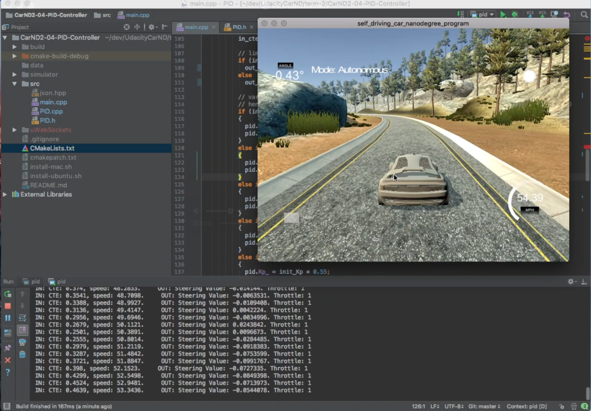

# PID Controller for Car in Simulator
Udacity Self-Driving Car Engineer Nanodegree Program

---

## Reflection (by Alexey Simonov)

The idea of PID controller is to use three components derived from the error 
(i.e. mismatch between the
ideal system state and the measured state), namely Proportional, Differential and Integral parts
to drive the system state to the ideal state. The detailed description is 
[here](https://en.wikipedia.org/wiki/PID_controller)

Proportional part is defining how sensitive our response is. If we set Proportional coefficient
higher the system tends to 'ideal state' quicker. But it may overshoot. So there is a tradeoff.

For Differential part the higher the coefficient the more responsive
the controller is to the rate of change in state, 
which tends to dampen the oscillations inherent to
Proportional part of PID.

Integral part of PID is used to correct for persistent bias, if it exists. Like a side wind
pushing the car off track etc. In this problem integral part was not required.

Here is a video of the final implementation performance:

Here I set Integral coefficient to zero to start with.

At first I used Twiddle algorithm to find optimal P, I, D parameters by running the simulator for
constant speed of around 25mph and calibrating the total error over all measurements over the
course of one full lap. This did not work fantastically well. 
It was slow and the resulting parameters
were not ideal. I have found it easier to tweak parameters by hand.

I then set a speed limit at 20mph and found I and D coefficients so that the car path
is very stable and close to the centerline.

I then increased the speed limit to 30mph and scaled my I and D coefficients that I used
for 20mph so that: I has decreased (to be less sensitive at higher speed) and D is increased 
to dampen any oscillations harder.

I then proceeded to repeat the parameter scaling for 40, 50, 60 and 70 mph.
The final PID controller parameters are graduated depending on current simulator speed.
I also ease off accelerator when steering angle goes above 3.75 degrees either way which
causes the controller to pretty much never apply the brakes as system self-corrects any
oscillations when they start to appear at higher speeds. If you change `speed_limit` variable
to something smaller, like 30 or 50 mph you will see the car applies brakes regularly.

The PID-controlled car manages to go between about 55mph and 70mph, 
depending on the part of the track.
The trickiest part is the first left corner after the bridge because it is preceeded by
straight path where car accelerates up to the tight turn. 
Because the controller is not predicting what would happen and only
responding based on current and some historical measurements it does not react very quickly.
One way to improve response here would be to increase P coefficient. But that would result
in instability on straigh parts of the track.

## Dependencies

* cmake >= 3.5
 * All OSes: [click here for installation instructions](https://cmake.org/install/)
* make >= 4.1
  * Linux: make is installed by default on most Linux distros
  * Mac: [install Xcode command line tools to get make](https://developer.apple.com/xcode/features/)
  * Windows: [Click here for installation instructions](http://gnuwin32.sourceforge.net/packages/make.htm)
* gcc/g++ >= 5.4
  * Linux: gcc / g++ is installed by default on most Linux distros
  * Mac: same deal as make - [install Xcode command line tools]((https://developer.apple.com/xcode/features/)
  * Windows: recommend using [MinGW](http://www.mingw.org/)
* [uWebSockets](https://github.com/uWebSockets/uWebSockets) == 0.13, but the master branch will probably work just fine
  * Follow the instructions in the [uWebSockets README](https://github.com/uWebSockets/uWebSockets/blob/master/README.md) to get setup for your platform. You can download the zip of the appropriate version from the [releases page](https://github.com/uWebSockets/uWebSockets/releases). Here's a link to the [v0.13 zip](https://github.com/uWebSockets/uWebSockets/archive/v0.13.0.zip).
  * If you run OSX and have homebrew installed you can just run the ./install-mac.sh script to install this
* Simulator. You can download these from the [project intro page](https://github.com/udacity/CarND-PID-Control-Project/releases) in the classroom.

## Basic Build Instructions

1. Clone this repo.
2. Make a build directory: `mkdir build && cd build`
3. Compile: `cmake .. && make`
4. Run it: `./pid`. 

## Project Instructions and Rubric

Note: regardless of the changes you make, your project must be buildable using
cmake and make!

More information is only accessible by people who are already enrolled in Term 2
of CarND. If you are enrolled, see [the project page](https://classroom.udacity.com/nanodegrees/nd013/parts/40f38239-66b6-46ec-ae68-03afd8a601c8/modules/f1820894-8322-4bb3-81aa-b26b3c6dcbaf/lessons/e8235395-22dd-4b87-88e0-d108c5e5bbf4/concepts/6a4d8d42-6a04-4aa6-b284-1697c0fd6562)
for instructions and the project rubric.

